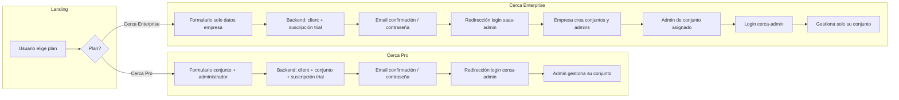

# Flujo de registro desde la landing: "Registra tu conjunto"

Especificación para el proyecto **landing-page** que alinea el formulario de registro con el esquema de base de datos (clients, eco_conjuntos, client_subscriptions), los planes **Cerca Pro** y **Cerca Enterprise**, y las dos plataformas: **saas-admin (Suscripciones)** y **cerca-admin**.

---

## 1. Introducción

Existen dos planes de registro desde la landing, cada uno con un flujo y una plataforma de destino distintos:

- **Cerca Pro:** para persona administradora (un solo conjunto / PH). Tras el registro, el usuario es redirigido al login de **cerca-admin** para gestionar su conjunto.
- **Cerca Enterprise:** para empresa administradora (varios conjuntos, opción de marca blanca). Tras el registro, el usuario recibe un email de confirmación y creación de contraseña y es redirigido al login de **saas-admin (Suscripciones)** para administrar su perfil, conjuntos, administradores de conjunto, subdominio e imágenes.

Los **administradores de conjunto** (creados por la empresa desde saas-admin) ingresan únicamente a **cerca-admin** con el correo y contraseña asignados por la empresa y solo pueden acceder al conjunto asignado.

---

## 2. Facturación

Para **ambos planes** (Cerca Pro y Cerca Enterprise), la facturación se da **por apartamento/unidad** dentro del conjunto o conjuntos registrados.

---

## 3. Planes disponibles y selector

En la landing debe existir un **selector de plan** que determine el tipo de registrante y el formulario a mostrar:

| Plan en la landing | client_type en BD | Formulario | Destino tras registro |
|-------------------|-------------------|------------|------------------------|
| **Cerca Pro** | `SINGLE_CONJUNTO` | Datos del conjunto + datos del administrador | Login **cerca-admin** |
| **Cerca Enterprise** (marca blanca, varios conjuntos) | `ADMIN_COMPANY` | Solo datos del cliente (empresa) + contacto | Login **saas-admin (Suscripciones)** |

- **Cerca Enterprise** incluye opción de marca blanca y está orientado a quienes administran varios conjuntos. Al seleccionarlo, el formulario muestra **solo datos de la empresa** (nombre empresa, NIT, ciudad, dirección, nombre contacto, correo, teléfono). Los conjuntos **no** se crean en la landing; se crean después del primer login en saas-admin.
- El valor del plan se envía en el payload como `plan_id` y determina `client_type` y el flujo en backend.

---

## 4. Selector de tipo de registrante (alineado con plan)

La elección del plan implica el tipo de registrante. En la landing puede mostrarse como selector explícito o derivado del plan:

| Opción en la landing | Valor enviado | client_type | Descripción |
|----------------------|---------------|-------------|-------------|
| **Soy persona administradora** (administro un solo conjunto / PH) | `SINGLE_CONJUNTO` | `SINGLE_CONJUNTO` | Un conjunto residencial; el “cliente” es ese único conjunto. Plan Cerca Pro. |
| **Soy empresa administradora** (administro varios conjuntos) | `ADMIN_COMPANY` | `ADMIN_COMPANY` | Una empresa que gestiona múltiples conjuntos. Plan Cerca Enterprise. |

Recomendación UX: mostrar el selector al inicio (antes o después de elegir el plan), con texto claro para cada opción.

---

## 5. Formulario por plan (mapeo a BD)

### 5.1 Cerca Pro (persona administradora / un conjunto)

Formulario: **datos del conjunto** + **datos del administrador**.

| Campo en la landing | Tabla destino | Columna | Notas |
|--------------------|---------------|---------|--------|
| Tipo de registrante / Plan | `clients` | `client_type` | `SINGLE_CONJUNTO` |
| Nombre del conjunto | `clients` | `name` | Nombre del conjunto como “cliente”. |
| | `eco_conjuntos` | `nombre` | Mismo valor. |
| NIT del conjunto | `clients` | `tax_id` | Identificación tributaria. |
| Ciudad | `clients` | `billing_city` | Ciudad de facturación/ubicación. |
| Dirección del conjunto | `clients` | `billing_address` | Dirección de facturación. |
| | `eco_conjuntos` | `direccion` | Misma dirección. |
| Nombre completo (administrador) | `clients` | `contact_name` | Contacto principal. |
| Correo electrónico (administrador) | `clients` | `contact_email` | Usado para Auth (login en cerca-admin). |
| Teléfono celular (administrador) | `clients` | `contact_phone` | Teléfono del administrador. |
| Plan seleccionado | `plans` | (existente) | `plan_id` (Cerca Pro). |
| Prueba gratuita 15 días | `client_subscriptions` | `trial_end_date` | `now() + 15 days`. |

Backend crea: **client** + **eco_conjunto** + **client_subscription** (con trial). Subdominio: opcional (NULL o generado desde el nombre).

### 5.2 Cerca Enterprise (empresa administradora)

Formulario: **solo datos del cliente (empresa)** y contacto. No se capturan datos del “primer conjunto” en la landing.

| Campo en la landing | Tabla destino | Columna | Notas |
|--------------------|---------------|---------|--------|
| Tipo de registrante / Plan | `clients` | `client_type` | `ADMIN_COMPANY` |
| Nombre de la empresa | `clients` | `name` | Nombre de la empresa. |
| NIT de la empresa | `clients` | `tax_id` | NIT de la empresa. |
| Ciudad | `clients` | `billing_city` | Ciudad de facturación. |
| Dirección de la empresa | `clients` | `billing_address` | Dirección de facturación. |
| Nombre completo (administrador de la empresa) | `clients` | `contact_name` | Contacto principal (admin_company). |
| Correo electrónico (administrador) | `clients` | `contact_email` | Usado para Auth (login en saas-admin). |
| Teléfono celular (administrador) | `clients` | `contact_phone` | Teléfono del administrador. |
| Plan seleccionado | `plans` | (existente) | `plan_id` (Cerca Enterprise). |

Backend crea: **client** (ADMIN_COMPANY) + **client_subscription** en estado **trial** (plan Cerca Enterprise). **No** se crea `eco_conjunto` en la landing; los conjuntos se crean desde saas-admin tras el primer login.

---

## 6. Flujo Cerca Pro (persona / un conjunto)

1. Usuario en landing elige **Cerca Pro** y completa “Datos del conjunto” + “Datos del administrador”.
2. Frontend envía los datos a la RPC/Edge Function de registro (pública o con clave anon).
3. Backend crea **client** (SINGLE_CONJUNTO) + **eco_conjunto** + **client_subscription** (con trial 15 días) y vincula `eco_conjuntos.active_subscription_id`.
4. Backend (o frontend) crea usuario en Auth con el `contact_email` y envía email de confirmación y creación de contraseña.
5. Tras confirmar y crear contraseña, el usuario es **redirigido al login de cerca-admin**.
6. El administrador del conjunto ingresa en **cerca-admin** y gestiona su único conjunto.

---

## 7. Flujo Cerca Enterprise (empresa)

1. Usuario en landing elige **Cerca Enterprise** y completa solo “Datos de la empresa” + “Datos del administrador de la empresa”.
2. Frontend envía los datos a la RPC/Edge Function de registro.
3. Backend crea **client** (ADMIN_COMPANY) y una **suscripción en estado trial** (plan Cerca Enterprise). **No** crea `eco_conjunto` en la landing.
4. Se envía **email de confirmación y creación de contraseña** al correo registrado.
5. Mensaje en pantalla: “Revisa tu correo para crear tu contraseña e ingresar”.
6. **Redirección al login de saas-admin (Suscripciones)** (ej. variable `SAAS_ADMIN_LOGIN_URL` en el proyecto landing-page).
7. Tras crear contraseña y primer login en saas-admin, la empresa (admin_company) administra perfil, **crea conjuntos**, **crea administradores de conjunto** (asignando correo, contraseña y conjunto), subdominio, imágenes (marca blanca), etc.

---

## 8. Activación del plan Enterprise

Para **activar** el plan Cerca Enterprise (salir de trial o habilitar todas las funcionalidades), la empresa debe cumplir:

- Registrar **al menos 2 conjuntos** (creados desde saas-admin).
- Cada conjunto con **NIT diferente** y **nombre diferente** entre sí.
- Un **mínimo de 500 apartamentos/unidades por conjunto** creado.

La facturación sigue siendo por apartamento/unidad dentro de los conjuntos registrados.

---

## 9. Dos plataformas: saas-admin y cerca-admin

### saas-admin (Suscripciones)

- **Quién ingresa:** Solo **super_admin** (Cerca interno) y **el administrador de la empresa (admin_company)** — es decir, solo clientes creados como empresa (ADMIN_COMPANY) con plan Cerca Enterprise. **No** ingresan los administradores de conjunto.
- **Acciones:** Gestionar perfil, crear/editar conjuntos, crear administradores de conjunto (asignar email, contraseña, conjunto), configurar subdominio, imágenes (marca blanca), etc.

### cerca-admin

- **Quién ingresa:** **Administrador de conjunto** (creado por la empresa desde saas-admin).
- **Restricción:** Solo puede ingresar **al conjunto asignado** (un conjunto por usuario).
- **Acceso:** Correo y contraseña asignados por la empresa administradora desde saas-admin.

---

## 10. Diagrama de flujo

---

## 11. Qué existe hoy vs qué falta

### Ya existe (panel admin, US-007)

- **clients** con `client_type`, `tax_id`, `billing_address`, `billing_city`, etc.
- **eco_conjuntos** con `client_id`, `nombre`, `direccion`, `subdominio`, `active_subscription_id`.
- **client_subscriptions** con `trial_end_date` (vista/rpc ya lo usan para estado “trial”).
- RPC **create_conjunto_with_subscription** (requiere `is_super_admin()`): crea conjunto + suscripción; no crea client ni usuario Auth, no establece `trial_end_date`.
- RPC **create_client_with_validation**: crea client (requiere super_admin).

### Falta para el flujo landing

1. **RPC o Edge Function de registro público** (sin `is_super_admin`), por ejemplo:
   - Para **Cerca Pro:** `register_conjunto_from_landing_pro(...)` que cree client (SINGLE_CONJUNTO) + eco_conjunto + client_subscription (trial 15 días) + vincule active_subscription_id.
   - Para **Cerca Enterprise:** `register_empresa_from_landing_enterprise(...)` que cree client (ADMIN_COMPANY) + client_subscription en estado trial (sin eco_conjunto).
   - Validación de unicidad (email, NIT, nombre según aplique).
2. **Auth:** signUp o magic link con `contact_email` y flujo de confirmación / creación de contraseña.
3. **Vinculación usuario ↔ cliente:** al confirmar, insertar en `admin_users` o tabla `client_users` (user_id, client_id, role: admin_company o conjunto_admin) para RLS.
4. **Políticas RLS:** usuario admin_company solo ve su client_id y sus conjuntos/suscripciones; administrador de conjunto solo ve su conjunto asignado (en cerca-admin).
5. **Regla de activación Enterprise:** validar en backend (2 conjuntos, NIT/nombres diferentes, mínimo 500 unidades por conjunto) para activar plan Enterprise.

---

## 12. Resumen para integración landing-page

Checklist para el equipo de la landing:

- **Selector de plan:** Cerca Pro vs Cerca Enterprise (opción marca blanca incluida o como checkbox en Enterprise).
- **Condicional del formulario:**
  - Si **Cerca Enterprise** → solo datos de la empresa + contacto (nombre empresa, NIT, ciudad, dirección, nombre contacto, correo, teléfono).
  - Si **Cerca Pro** → datos del conjunto + datos del administrador (nombre conjunto, NIT, ciudad, dirección, nombre contacto, correo, teléfono).
- **Payload a enviar al backend:** Incluir `plan_id`, `client_type` (derivado del plan), y los campos del formulario según el plan (ver secciones 5.1 y 5.2).
- **Comportamiento tras submit:**
  - Mensaje: “Revisa tu correo para crear tu contraseña e ingresar”.
  - **Cerca Enterprise** → redirección a URL de login **saas-admin** (ej. `SAAS_ADMIN_LOGIN_URL`).
  - **Cerca Pro** → redirección a URL de login **cerca-admin** (ej. `CERCA_ADMIN_LOGIN_URL`).
- **Referencia:** El administrador de conjunto se crea desde saas-admin (por la empresa) y accede solo por cerca-admin al conjunto asignado; la landing no implementa ese flujo.

Este documento sirve como especificación para implementar el registro desde la landing y la integración con saas-admin y cerca-admin.
